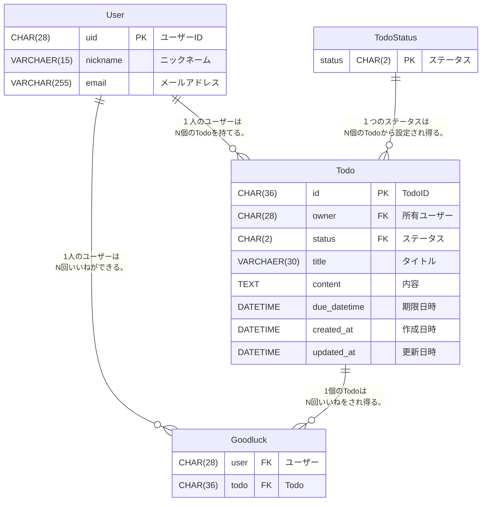

# go-gin-webapi

アカウント登録機能が付いたTODOリストを作る。

## 技術スタック

- Go
- Gin
- MySQL
- Firebase Authentication
- OpenAPI

## 機能一覧

- 会員登録
- ログイン
- ログアウト
- ユーザー詳細取得
- ユーザー情報編集
- Todo作成
- Todo編集
- Todo削除
- Todo詳細取得
- Todo一覧取得
- いいね作成
- いいね削除

## ER 図



## ローカル動作確認

APIのベースURLは `http://localhost:8080/api/v1`

### 環境変数（`app/.env`）

このプロジェクトは `.devcontainer/docker-compose.yml` で `app/.env` を読み込みます。
ローカル動作確認のため、`app/.env` を作成してください（例）:

```dotenv
# Server
PORT=8080

# Database (MySQL)
# ローカルでGoを直接起動する場合は DB_HOST=127.0.0.1 を推奨
DB_HOST=127.0.0.1
DB_PORT=3306
DB_USER=root
DB_PASSWORD=root
DB_NAME=go-gin-webapi

# 開発用: Firebase無しで動作確認する場合 true
AUTH_BYPASS=true

# Firebase（register/login を試す場合に設定）
# FIREBASE_API_KEY=
# FIREBASE_PROJECT_ID=
# FIREBASE_CREDENTIALS_FILE=
# FIREBASE_SERVICE_ACCOUNT_JSON=
# FIREBASE_AUTH_EMULATOR_HOST=
```

### 1) DBを起動（Docker）

リポジトリルートで以下を実行します（MySQLのみ起動）:

```bash
docker compose -f .devcontainer/docker-compose.yml up -d db
```

初回は `.devcontainer/db/initdb.d/init_table.sql` が自動で適用され、テーブルが作られます。

### 2) APIサーバを起動（Goをローカルで実行）

別ターミナルで以下を実行します:

```bash
make dev
```

### 3) 疎通確認（Firebase無し: `AUTH_BYPASS=true`）

`AUTH_BYPASS=true` の場合、Bearerの代わりに `X-User-Id` ヘッダで認可を通せます。
テスト用の `uid` は **28文字**にしてください（DB定義: `CHAR(28)`）。

```bash
UID=testuser0000000000000000000000

# ユーザー作成（DBに1行入れるだけ：register/login を使わない場合）
mysql -h 127.0.0.1 -P 3306 -uroot -proot go-gin-webapi \
  -e "INSERT INTO users(uid,nickname,email) VALUES('${UID}','tester','tester@example.com');"

# Todo作成
curl -sS -X POST "http://localhost:8080/api/v1/users/${UID}/todos" \
  -H "Content-Type: application/json" \
  -H "X-User-Id: ${UID}" \
  -d '{"title":"hello","content":"world","status":"00"}'

# Todo一覧
curl -sS "http://localhost:8080/api/v1/users/${UID}/todos" \
  -H "X-User-Id: ${UID}"
```

### 4) 疎通確認（Firebaseあり: register/login）

`/register` と `/login` を使う場合は、少なくとも `FIREBASE_API_KEY` が必要です。
Bearer認証（`/users/...` など）や `/logout` の revoke を正しく動かすには、Firebase Admin SDK の設定も必要です。

- **必要**: `FIREBASE_API_KEY`
- **推奨**: `FIREBASE_PROJECT_ID` と、以下いずれか
  - `FIREBASE_CREDENTIALS_FILE`（サービスアカウントJSONへのパス）
  - `FIREBASE_SERVICE_ACCOUNT_JSON`（サービスアカウントJSON文字列）

### Swagger

起動後、`/swagger.json` で生成されたOpenAPIのSwagger JSONを確認できます。
