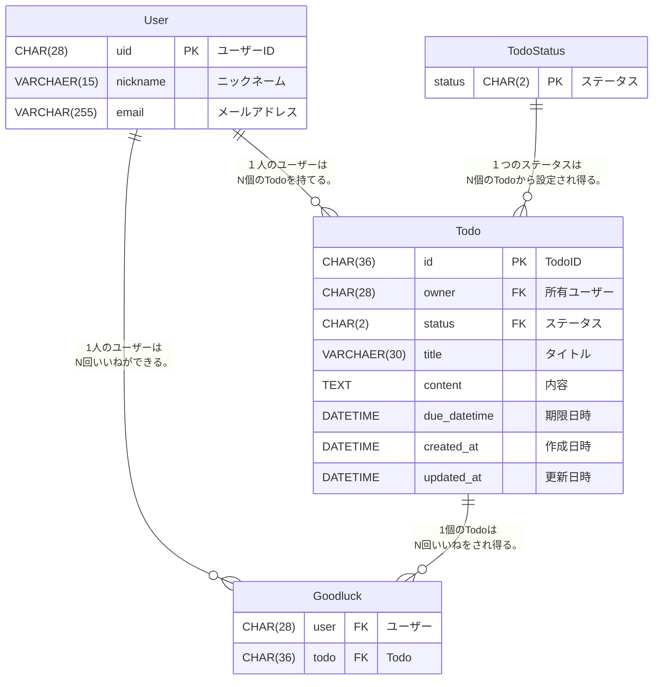

# go-gin-webapi

アカウント登録機能が付いたTODOリストを作る。

## 技術スタック

- Go
- Gin
- MySQL
- Firebase Authentication
- OpenAPI

## 機能一覧

- 会員登録
- ログイン
- ログアウト
- ユーザー詳細取得
- ユーザー情報編集
- Todo作成
- Todo編集
- Todo削除
- Todo詳細取得
- Todo一覧取得
- いいね作成
- いいね削除

## ER 図

